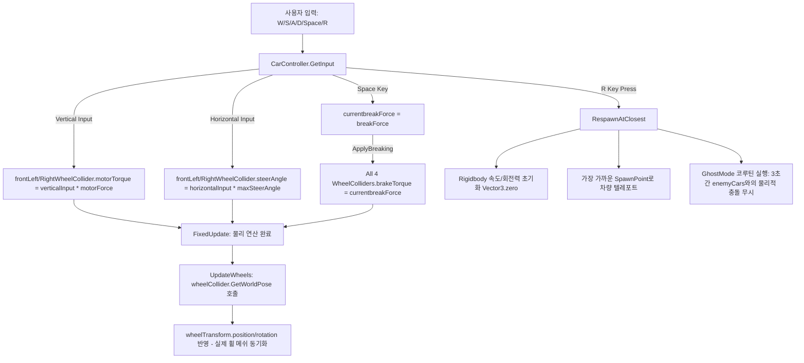
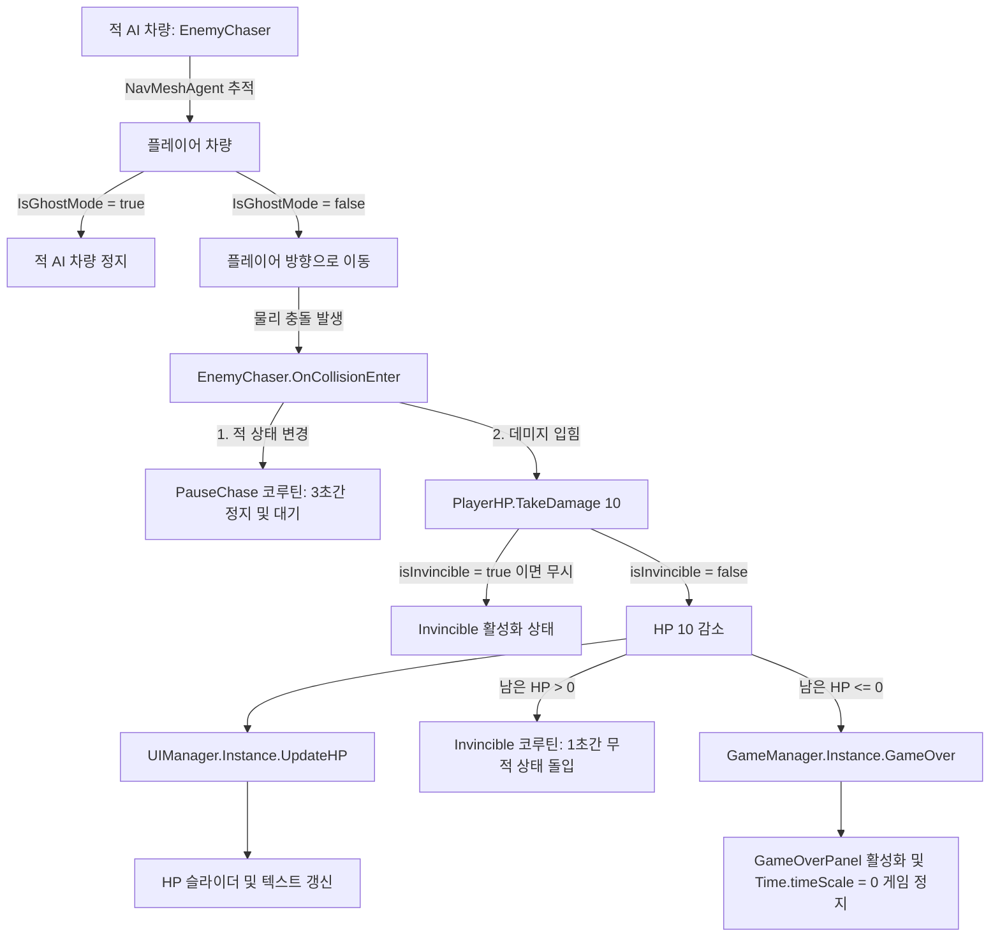
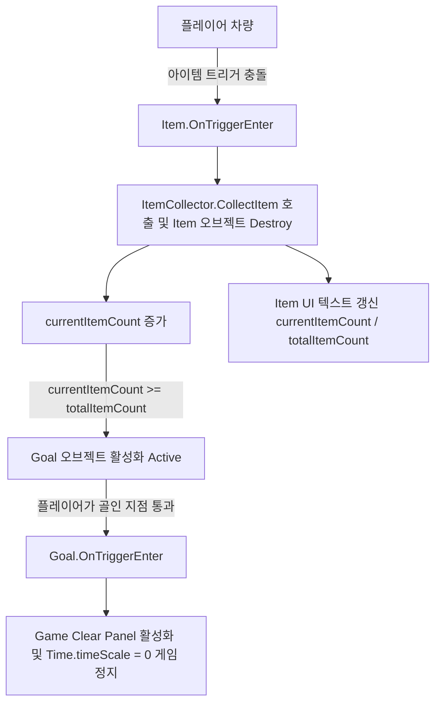
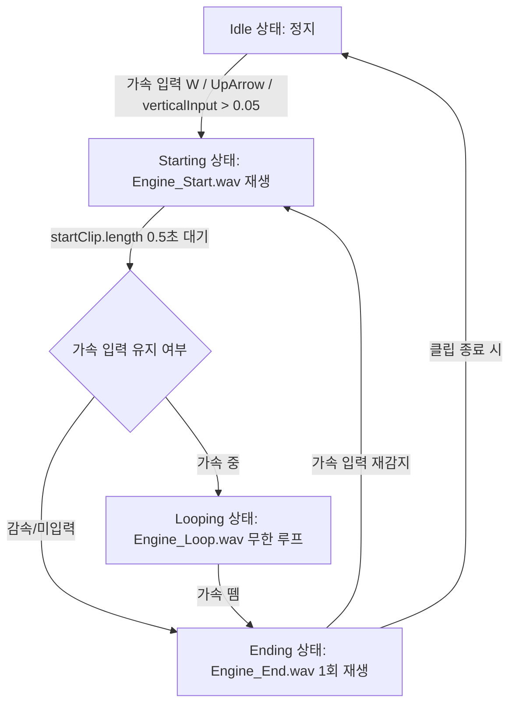

# 자동차 시스템 인과관계 분석 보고서 (Vehicle System Analysis)

이 게임의 자동차 제어, 충돌, 아이템 수집, UI 및 사운드 시스템에 관한 데이터 흐름과 트리거 메커니즘을 흐름도와 함께 상세히 분석한 자료입니다.

---

## 1. 시스템 핵심 흐름도 (System Flowcharts)

### A. 조작 및 물리 제어 흐름 (Input & Physics Flow)

### B. 충돌 및 플레이어 체력 제어 흐름 (Collision & HP Flow)

### C. 아이템 수집 및 클리어 흐름 (Item Collection & Victory Flow)

### D. 엔진 사운드 상태 머신 (Engine Sound State Machine)

---

## 2. 컴포넌트별 상세 동작 분석 (Component Analysis)

### [CarController.cs](file:///c:/SpaceMD_Proj/Assets/Scripts/CarController.cs)
차량 조작 및 물리 연산을 처리하는 컴포넌트입니다.
* **조작 방식**: `FixedUpdate`에서 입력을 감지하고 물리 처리를 합니다.
  * **전진/후진**: `verticalInput` 값에 `motorForce`를 곱하여 전륜 `WheelCollider`의 `motorTorque`에 대입합니다.
  * **조향**: `horizontalInput` 값에 `maxSteerAngle`을 곱하여 전륜 `WheelCollider`의 `steerAngle`에 대입합니다.
  * **브레이크**: `Space` 키가 입력되면 전륜 및 후륜 4개 바퀴의 `brakeTorque`에 `breakForce`를 적용합니다.
* **바퀴 시각화**: `UpdateWheels` 단계에서 `wheelCollider.GetWorldPose`를 활용해 물리 엔진상의 바퀴 위치/회전 값을 실제 보여지는 3D 바퀴 트랜스폼 모델에 동기화합니다.
* **리스폰 기능 (`R` 키)**: 
  * 차량 리지드바디의 속도와 회전 속도를 완전히 초기화(`linearVelocity = Vector3.zero`, `angularVelocity = Vector3.zero`)합니다.
  * 맵 내에 배치된 `spawnPoints` 중 플레이어와 직선거리가 가장 가까운 지점으로 차량을 순간이동 시킵니다.
  * 리스폰 후 즉사 방지를 위해 `GhostMode` 코루틴을 돌려 `3초` 동안 적 차량들과의 충돌 연산을 물리적으로 무시(`Physics.IgnoreCollision`)합니다.

### [PlayerHP.cs](file:///c:/SpaceMD_Proj/Assets/Scripts/PlayerHP.cs)
플레이어의 체력 정보를 제어하고 관리합니다.
* **데미지 감쇄**: `TakeDamage(int damage)` 함수가 실행될 때 무적 상태(`isInvincible == true`)가 아닐 경우 `currentHP`를 차감합니다.
* **무적 시간**: 피해를 입은 직후 1초간 `isInvincible` 상태가 되며 연속 데미지를 방지합니다.
* **체력 갱신 UI**: 체력이 차감될 때마다 싱글톤 매니저인 `UIManager.Instance.UpdateHP`를 호출하여 화면에 표시합니다.
* **게임 오버**: 체력이 `0` 이하가 되면 `GameManager.Instance.GameOver()`를 호출해 게임을 정지시킵니다.

### [EnemyChaser.cs](file:///c:/SpaceMD_Proj/Assets/Scripts/EnemyChaser.cs)
적 차량 AI를 관리하며 `NavMeshAgent`를 사용하여 플레이어 차량을 추적합니다.
* **추적 로직**: `Update` 함수 내에서 주기적으로 플레이어의 실시간 위치(`player.position`)를 `NavMeshAgent` 목적지로 주입합니다.
  * 단, 플레이어가 리스폰 중이어서 `IsGhostMode`가 활성화되었거나 적 차량이 정지 상태(`isPaused == true`)일 경우 추적을 멈춥니다(`agent.isStopped = true`).
* **충돌 트리거**: 플레이어의 콜라이더와 부딪히면 `OnCollisionEnter`가 트리거됩니다.
  * 플레이어가 정지 상태가 아닐 때 플레이어의 `PlayerHP`를 가져와 `TakeDamage(10)`로 10만큼 데미지를 입힙니다.
  * 충돌 후 곧바로 적 차량은 `PauseChase` 코루틴을 타고 `3초`간 정지 상태가 되어 플레이어가 탈출할 기회를 제공합니다.

### [ItemCollector.cs](file:///c:/SpaceMD_Proj/Assets/Scripts/ItemCollector.cs) 및 [Item.cs](file:///c:/SpaceMD_Proj/Assets/Scripts/Item.cs)
아이템 수집 기능을 정의합니다.
* **아이템 충돌**: 월드에 배치된 보석/아이템과 충돌하면 `Item.OnTriggerEnter`가 발동해 충돌한 대상의 `ItemCollector.CollectItem()`을 호출하고 아이템 오브젝트는 즉시 파괴(`Destroy`)됩니다.
* **골 트리거 개방**: 수집 개수(`currentItemCount`)가 증가하고 UI에 수집률이 갱신됩니다. 만약 맵 내 전체 아이템 개수(`totalItemCount`)만큼 모두 수집했다면, 비활성화되어 있던 목적지인 `goal` 게임 오브젝트를 액티브 상태(`goal.SetActive(true)`)로 전환합니다.

### [Goal.cs](file:///c:/SpaceMD_Proj/Assets/Scripts/Goal.cs)
활성화된 결승점(골 지점)에 통과하면 동작합니다.
* **게임 클리어**: 플레이어가 골 트리거에 접촉하고 `ItemCollector`를 통해 모든 아이템을 모았음이 확인되면, 승리 화면 패널(`clearPanel`)을 띄우고 `Time.timeScale = 0`으로 게임 진행을 중지시킵니다.

### [VehicleEngineSound.cs](file:///c:/SpaceMD_Proj/Assets/Scripts/VehicleEngineSound.cs)
차량 가속 입력에 유기적으로 연결된 엔진 상태 머신 오디오 시스템입니다.
* **가속도 입력 감지**: 키 입력(W, 방향키 위)이나 세밀한 축 입력(`verticalInput > 0.05f`)을 가속 상태로 감지합니다.
* **상태 전환 메커니즘**:
  * **Idle**: 멈춰있는 상태에서 가속을 누르면 `Starting` 상태로 전환하며 `Engine_Start.wav`를 재생합니다.
  * **Starting**: 가속 시작음이 끝까지(0.5초) 모두 재생될 때까지 무조건 기다린 후, 가속 상태가 계속 유지 중이면 `Looping` 상태로, 가속에서 발을 뗐다면 `Ending` 상태로 전환합니다.
  * **Looping**: `Engine_Loop.wav`를 루프 재생하며, 가속 입력을 떼는 즉시 감속 사운드 상태인 `Ending`으로 넘어갑니다.
  * **Ending**: `Engine_End.wav`를 1회 재생하며, 재생 도중 다시 가속을 누르면 즉시 `Starting` 상태로 돌아가 가속을 시작합니다. 재생이 완료되면 `Idle` 상태로 회귀합니다.

### [UIManager.cs](file:///c:/SpaceMD_Proj/Assets/Scripts/UIManager.cs) 및 [GameManager.cs](file:///c:/SpaceMD_Proj/Assets/Scripts/GameManager.cs)
게임 전반의 UI 요소와 승리/패배 상태를 조율합니다.
* **UIManager**: 체력 상태(`HP : 100` 형태의 텍스트와 Slider 가시성)를 갱신합니다.
* **GameManager**: `GameOver` 발생 시 패배화면 패널(`gameOverPanel`)을 활성화하고 시간을 정지시키며, 재시작(`Restart`) 시 로드 타임을 초기화한 후 씬을 다시 부릅니다.
